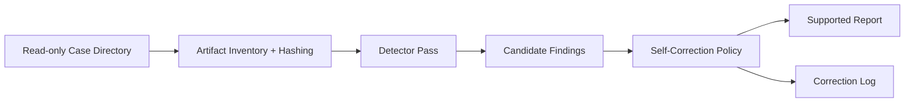

# Architecture

## Guardrails

- Read-only input case directory.
- SHA-256 hashes are recorded before analysis.
- Findings must cite artifacts.
- High-severity findings require at least two evidence references in this prototype policy.
- Removed or downgraded claims are included in `selfCorrections`.

## Protocol SIFT Integration Path

The current demo uses local JSON/log artifacts for portability. The same detector and correction stages can be exposed as MCP tools around SIFT commands such as timeline generation, login review, process listing, and network connection review.

